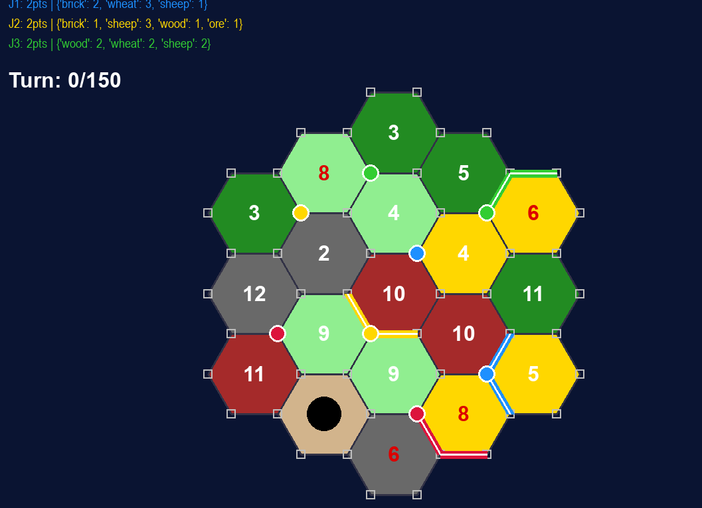
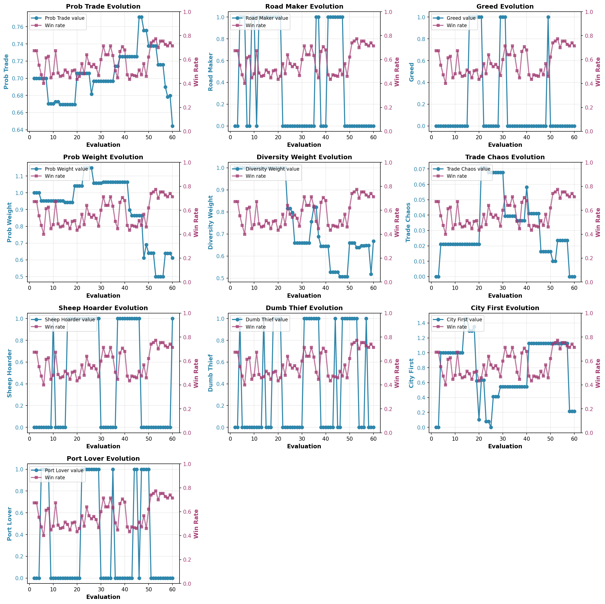
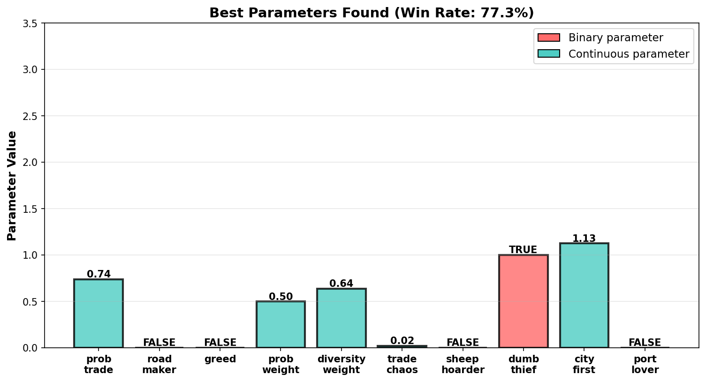
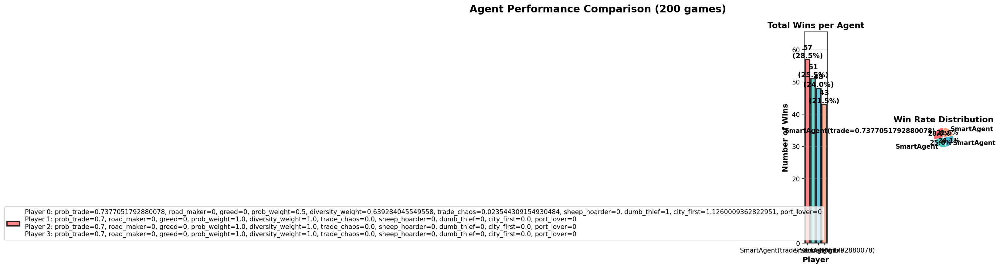

# Catan Simulator

## Project Objective

This project is a full Catan simulation written in Python.
It was built to run many games quickly and compare agent strategies in a controlled way.



The core goal is practical: measure behavior, tune decision parameters, and understand which heuristics actually help in a 4-player game.
The codebase includes a complete game engine, baseline and heuristic agents, a fine-tuning loop, and visual tools.

## Dataset

There is no external dataset to download.
The data is generated by simulation.

Each game starts from a randomized official Catan board setup:

- 19 hexes total
- Resource counts: wood 4, brick 3, sheep 4, wheat 4, ore 3, desert 1
- Number tokens on non-desert hexes: 2, 3, 3, 4, 4, 5, 5, 6, 6, 8, 8, 9, 9, 10, 10, 11, 11, 12
- 4 players per game

For fine-tuning, the evaluation mix is also generated on the fly:

- 50% games vs 3 RandomAgent opponents
- 25% games vs 3 default SmartAgent opponents
- 25% games vs 3 randomized SmartAgent opponents

This creates a robust training distribution instead of overfitting to one opponent profile.

## Methodology

### 1. Game engine and state modeling

The engine implements full turn logic: dice roll, robber phase, production, trading, building, and win checks.
The board uses axial coordinates for hexes and shared vertex identifiers for settlements and roads.
This keeps geometry consistent and makes legal-move checks reliable.

### 2. Agent design

Two families of agents are implemented.

- RandomAgent samples legal actions with optional behavior toggles.
- SmartAgent scores actions with hand-crafted heuristics.

SmartAgent combines probability of production, resource diversity, road expansion value, city timing, and robber targeting.
The objective is not perfect play, but strong and explainable play.

### 3. Parameter optimization with simulated annealing

SmartAgent has 10 tunable parameters.
We optimize them with simulated annealing.
At each evaluation, a candidate parameter set is mutated and tested over many full games.
Worse candidates can still be accepted early, which helps avoid local minima.
Acceptance becomes stricter as temperature cools.

Optimization artifacts are saved in fine_tuning_results.



## Key Equations

The model relies on a few core equations.
They are simple, but they drive most strategic behavior.

1. Dice sum probability for value n in {2, ..., 12}:

$$
P(\text{sum}=n)=\frac{6-|n-7|}{36}
$$

This gives the exact chance of each dice total.
Values 6 and 8 are high-value tiles because they occur often.

2. Expected production of a settlement on adjacent numbers n1, n2, n3:

$$
\mathbb{E}[\text{prod}] = \sum_{i=1}^{3} P(\text{sum}=n_i)
$$

A city simply doubles this expectation.
This is why placement quality has a large long-term effect.

3. Simulated annealing acceptance rule:

$$
\Delta = w(\theta') - w(\theta), \quad
P_{\text{accept}} =
\begin{cases}
1, & \Delta > 0 \\
\exp\left(\frac{\Delta}{\max(0.01, T)}\right), & \Delta \le 0
\end{cases}
$$

If a candidate is better, we always keep it.
If it is worse, we may still keep it, mostly at high temperature.
This preserves exploration early and stability later.

## Evaluation

The numbers below come from the saved run in fine_tuning_results/best_parameters_20260320_162409.txt.

- Total evaluations: 60
- Games per evaluation: 150
- Total games: 9000
- Best win rate: 77.3%
- 4-player chance baseline: 25.0%

Best parameter set from that run:

- prob_trade: 0.7377051792880078
- road_maker: False
- greed: False
- prob_weight: 0.5
- diversity_weight: 0.639284045549558
- trade_chaos: 0.023544309154930484
- sheep_hoarder: False
- dumb_thief: True
- city_first: 1.1260009362822951
- port_lover: False

Saved plots:




## Repository Structure

```text
Catan/
├── agents/
│   ├── base.py
│   ├── random_agent.py
│   └── smart_agent.py
├── game/
│   ├── board.py
│   ├── core.py
│   ├── map.py
│   ├── player.py
│   └── rules.py
├── charts.py
├── fine_tuning.py
├── main.py
├── run_finetuning.py
├── train.py
├── play_human.py
├── test_baseline.py
├── test_finetuning_quality.py
├── vizualize.py
├── requirements.txt
└── fine_tuning_results/
```

## Installation and Execution

Install dependencies:

```bash
python -m pip install -r requirements.txt
```

Run a baseline multi-agent simulation:

```bash
python main.py
```

Run the explicit training/benchmark launcher:

```bash
python train.py
```

Run fine-tuning (simulated annealing + result plots):

```bash
python run_finetuning.py
```

Run a visual game loop with pygame:

```bash
python play_human.py
```

Run baseline quality checks:

```bash
python test_baseline.py
python test_finetuning_quality.py
```